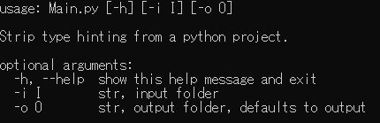

# TypeStripper [](https://travis-ci.com/Wally869/TypeStripper)

Utility to delete all type hinting from a Python script.


## Why?

I use type hinting a lot when writing Python but I stumbled upon a specific case where I need to strip the type hinting of my scripts to ensure the script can run.  

The typing package does not allow you to use the class you are defining as a type hint for one of its method. The following is allowed by using the annotations module of future since it converts the type annotations to strings to be ignored at runtime. 

```python
from __future__ import annotations

class Foo:
    def Bar() -> Foo:
        return Foo()
```

My use case is when using Transcrypt, or Bryton to use Python in the browser: the type hinting allowed by the annotations module and described above is not allowed and must be removed.

So instead of manually doing the work every time, this utility script takes a folder as input and outputs new python files stripped of all type hinting in a new folder.

## How to Use

This script was made with a Python 3.7.4 install and requires Pathlib which requires Python 3.5+.

Call the script from the CLI:

```command line
    python Main.py -i myPackageFolder -o outputFolder
```




## Currently Supported Patterns

Simple patterns are supported, which should cover most cases.
Currently unsupported:
- Lists, Unions etc are only detected for up to 2 components.  
- No support for type names containing underscores  


See Below for details (type names are provided as illustrations).


```python
    r":\s[a-zA-Z]+\[[a-zA-Z]+,\s[a-zA-Z]+\]",       # matches ': Union[int, Note]'
    r":\s[a-zA-Z]+\[[a-zA-Z]+",                     # matches ': List[float]'
    r"\s->\s[a-zA-Z]+\[[a-zA-Z]+,\s[a-zA-Z]+\]",    # matches ' -> Union[int, Note]'
    r"\s->\s[a-zA-Z]+\[[a-zA-Z]+",                  # matches ' -> List[float]'
    r"\s->\s[a-zA-Z]+",                             # matches ' -> Note'
    r":\s[a-zA-Z]+",                                # matches ': int'
```


## Known Errors

Lambda functions
Dictionnaries
Dataclasses type annotations


## Improvements

- Fix errors by checking for parentheses and comas?
- Add preprocessing directives #NoStrip